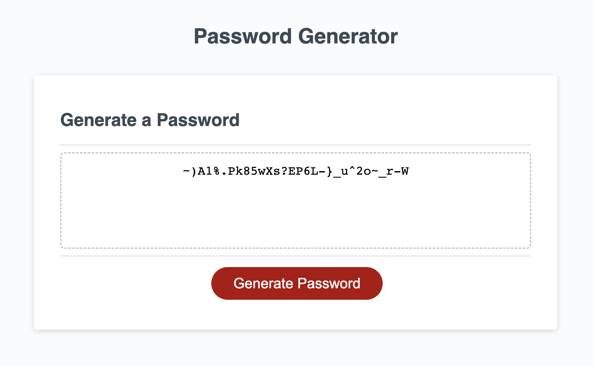

# Password Generator

## Description

In this code, we generate random password between 10 and 64 characters. Includes uppercase, lowercase, numeric and special characters.

## Installation

N/A

## Usage

You can see the image of the project below.
  

## Links

<b>Source Code</b>
 
https://github.com/ozgencmardi/password-generator

<b>Website URL</b>
 
https://ozgencmardi.github.io/password-generator

## Credits

N/A

## License

Please refer to the LICENSE in the repo.